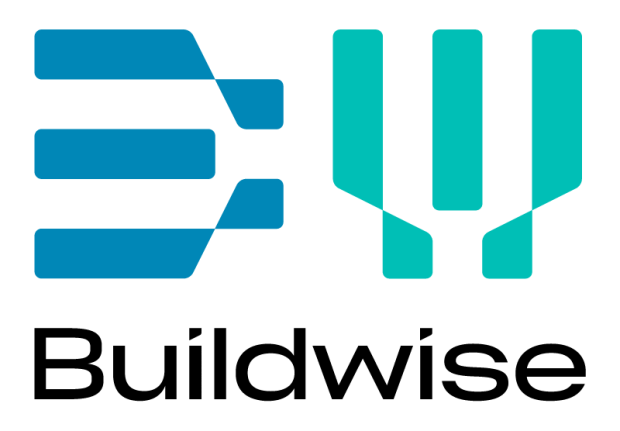

# AI Construct PDF Diviseur

<div align="center">
  
  &nbsp;&nbsp;&nbsp;&nbsp;&nbsp;&nbsp;
  
</div>

<p align="center">
  <em>Application GUI moderne pour diviser les documents de construction par catégories d'entrepreneurs</em>
</p>

---

## 🌐 Langue / Language / Taal

📖 **[English](README.md)** | 🇳🇱 **[Nederlands](README.nl.md)** | 🇫🇷 **Français**

---

## 🚀 Nouveauté : Système de Traitement Hybride

Cette application prend en charge **les documents de construction VMSW et non-VMSW** avec un traitement intelligent :

- **🔢 Documents VMSW** : Utilise la correspondance de catégories basée sur les numéros pour une vitesse et une précision élevées
- **🤖 Documents non-VMSW** : Utilise l'analyse sémantique alimentée par l'IA avec Google Gemini
- **🎯 Détection Intelligente** : Détecte automatiquement le type de document avec option de remplacement manuel
- **⚡ Performance** : La catégorisation VMSW est 1000x plus rapide que le traitement IA
- **🖥️ GUI Moderne** : Interface réactive avec suivi des progrès en temps réel

---

## Aperçu

L'AI Construct PDF Diviseur est un outil puissant pour traiter les documents de spécifications de construction (cahiers des charges). Il analyse intelligemment les documents, extrait la structure, catégorise le contenu et divise les documents en PDF spécifiques aux entrepreneurs.

### 🎯 Fonctionnalités Principales

- **Intelligence Hybride** : Combine la correspondance VMSW basée sur les numéros avec l'analyse sémantique IA
- **GUI Réactive** : Plus de gel pendant les longues opérations
- **Progrès en Temps Réel** : Barres de progression en direct et mises à jour de statut
- **Sélection du Type de Document** : Choisissez entre les modes de traitement VMSW et non-VMSW
- **Sélection de Modèle** : Choisissez entre Gemini 2.5 Pro et Gemini 2.5 Flash
- **Support d'Annulation** : Arrêtez les opérations en cours de processus
- **Multi-Sortie** : Générez des PDF dans plusieurs dossiers de sortie simultanément
- **Journalisation Professionnelle** : Journal à défilement automatique avec horodatage et utilitaires de débogage

### 📋 Pipeline de Traitement

1. **📖 Génération TOC** : Extrait les chapitres et sections des documents PDF
2. **🎯 Catégorisation Intelligente** : 
   - **VMSW** : Mappage direct quasi-instantané des numéros (ex. "02.40" → "02. Fondations et Caves")
   - **Non-VMSW** : Correspondance sémantique IA avec catégories prédéfinies
3. **📄 Division de Document** : Crée des PDF séparés pour chaque catégorie de construction

---

## 📦 Installation

### Prérequis

- **Python** : 3.7 - 3.13 (3.13 recommandé)
- **Connexion Internet** : Requise pour le traitement IA (documents non-VMSW)
- **Compte Google Cloud** : Pour le traitement IA non-VMSW

### Installation Rapide

1. **Exécutez le script d'installation :**
   ```bash
   python setup.py
   ```
   Cela va :
   - Vérifier la compatibilité de version Python
   - Installer toutes les dépendances
   - Créer les dossiers nécessaires
   - Exécuter les vérifications de validation

2. **Configurez l'environnement (optionnel) :**
   ```bash
   cp .env.example .env
   # Éditez .env avec votre ID de projet Google Cloud
   ```

### Installation Manuelle

1. **Installez les dépendances :**
   ```bash
   pip install -r requirements.txt
   ```

2. **Configuration Google Cloud (non-VMSW uniquement) :**
   ```bash
   # Installez Google Cloud CLI : https://cloud.google.com/sdk/docs/install
   pip install --upgrade google-genai
   gcloud auth application-default login
   ```

3. **Validez l'installation :**
   ```bash
   python src/utils/validation.py
   ```

### Lancer l'Application

```bash
python src/main.py
```

---

## 🖥️ Utilisation de l'Application

### Démarrage Rapide

1. **📁 Sélectionnez PDF** : Choisissez votre document de construction
2. **⚙️ Type de Document** : Sélectionnez "Document VMSW" ou "Document non-VMSW"
3. **📂 Dossier de Sortie** : Choisissez où sauvegarder les résultats
4. **▶️ Traiter** : Cliquez sur "Exécuter le Pipeline Complet"

### Guide des Types de Documents

| Type de Document | Quand Utiliser | Exigences | Vitesse |
|------------------|----------------|-----------|---------|
| **Document VMSW** | Documents avec numérotation VMSW (format XX.YY) | Aucune - utilise les catégories intégrées | ⚡ Ultra Rapide |
| **Document non-VMSW** | Autres documents de construction | Fichier de catégories + configuration Google Cloud | 🤖 Alimenté par IA |

### Options Avancées

- **🎛️ Sélection de Modèle** : Choisissez Gemini 2.5 Pro (précision) ou Flash (vitesse)
- **📁 Sorties Multiples** : Configurez jusqu'à 3 dossiers de sortie différents
- **🔧 Étapes Individuelles** : Exécutez TOC, Catégorisation ou division PDF séparément
- **📊 Journalisation Temps Réel** : Consultez les journaux de traitement détaillés et les infos de débogage
- **⏹️ Annulation** : Arrêtez le traitement à tout moment

---

## 📁 Architecture du Projet

```
├── src/                          # Architecture modulaire moderne
│   ├── main.py                   # Point d'entrée de l'application
│   ├── config/                   # Gestion de configuration
│   │   ├── __init__.py
│   │   └── settings.py           # Paramètres centralisés
│   ├── core/                     # Logique de traitement principal
│   │   ├── __init__.py
│   │   ├── ai_client.py          # Intégration Vertex AI
│   │   ├── pdf_processor.py      # Génération TOC & division PDF
│   │   ├── category_matcher.py   # Correspondance de catégories IA
│   │   ├── hybrid_matcher.py     # Gestion intelligente du type de document
│   │   ├── vmsw_matcher.py       # Correspondance VMSW basée sur les numéros
│   │   └── file_utils.py         # Opérations sur fichiers
│   ├── gui/                      # Composants d'interface utilisateur
│   │   ├── __init__.py
│   │   ├── main_window.py        # Fenêtre principale de l'application
│   │   ├── components/           # Composants UI réutilisables
│   │   │   ├── __init__.py
│   │   │   └── styled_components.py
│   │   └── workers/              # Traitement en arrière-plan
│   │       ├── __init__.py
│   │       └── processing_worker.py
│   ├── models/                   # Modèles de données et catégories
│   │   ├── __init__.py
│   │   └── categories.py         # Définitions de catégories
│   └── utils/                    # Modules utilitaires
│       ├── __init__.py
│       ├── validation.py         # Validation d'installation
│       └── migration.py          # Utilitaires de migration
├── launch.py                     # Script de lancement simple
├── setup.py                      # Script d'installation
├── example_categories.py         # Modèle de catégories
├── VMSWcat.json                  # Configuration des catégories VMSW
├── requirements.txt              # Dépendances Python
├── .env.example                  # Modèle de configuration d'environnement
└── documentation/                # Documentation complète
```

---

## 🎯 Traitement VMSW vs non-VMSW

### Documents VMSW

**Parfait pour** : Documents de construction néerlandais avec numérotation VMSW standard

**Comment ça fonctionne** :
- Mappe directement les numéros de chapitres aux catégories (ex. "02" → "02. Fondations et Caves")
- L'étape de catégorisation est quasi-instantanée et ne nécessite pas d'IA
- Détection de démolition intégrée
- Scores de confiance de 100%

**Les catégories incluent** :
- 00. Dispositions Générales
- 01. Démolition et Terrassements
- 02. Fondations et Caves
- Et 31 autres catégories VMSW standard...

### Documents non-VMSW

**Parfait pour** : Documents de construction personnalisés, formats internationaux

**Comment ça fonctionne** :
- L'IA analyse le contenu sémantiquement
- Correspond aux définitions de catégories personnalisées
- Fournit des scores de confiance et des explications
- Logique de nouvelle tentative intelligente pour de meilleurs résultats

**Exigences** :
- Fichier de catégories personnalisé (Python, Excel ou CSV)
- Projet Google Cloud avec Vertex AI activé

---

## 🔧 Personnalisation des Catégories VMSW

L'application offre des options flexibles pour personnaliser comment les documents VMSW sont groupés en catégories d'entrepreneurs.

### Groupement VMSW par Défaut

Par défaut, les documents VMSW utilisent un **système de mappage à deux niveaux** :

1. **Mappage Direct des Chapitres** (`src/core/vmsw_matcher.py`) : Mappe les chapitres VMSW (00-42) aux catégories de construction larges
2. **Mappage Détaillé des Articles** (`VMSWcat.json`) : Mappe les articles VMSW spécifiques aux groupements spécialisés

### Options de Personnalisation

#### Option 1 : Modifier les Groupements de Chapitres (Simple)

Éditez le dictionnaire `vmsw_mapping` dans `src/core/vmsw_matcher.py` :

```python
self.vmsw_mapping = {
    "00": "33. Conseils et Études",
    "01": "01. Démolition et Terrassements", 
    "02": "02. Fondations et Caves",
    # Ajoutez vos mappages personnalisés :
    "15": "15. CVC",  # Par défaut
    "15": "15. Climatisation",  # Nom personnalisé
    # Groupez plusieurs chapitres ensemble :
    "64": "15. CVC",  # Fusionner avec CVC existant
    "65": "15. CVC",
    "66": "15. CVC",
}
```

#### Option 2 : Créer des Groupements Spécifiques aux Entrepreneurs

Modifiez `VMSWcat.json` pour créer des catégories spécifiques aux entrepreneurs :

```json
[
  {
    "art_nr": "20 + 21 + 22",
    "omschrijving": "MAÇONNERIE - Entrepreneur A"
  },
  {
    "art_nr": "30 + 31 + 32", 
    "omschrijving": "TOITURE - Entrepreneur B"
  },
  {
    "art_nr": "64 + 65 + 66 + 67 + 68 + 69",
    "omschrijving": "CVC - Entrepreneur C"
  }
]
```

### Stratégies de Groupement Communes

#### Par Métier/Spécialité
```json
{
  "art_nr": "10 + 17 + 90 + 91",
  "omschrijving": "TERRASSEMENTS ET ASSAINISSEMENT"
},
{
  "art_nr": "64 + 65 + 66 + 67 + 68 + 69", 
  "omschrijving": "CVC PACKAGE COMPLET"
}
```

#### Par Phase de Projet
```json
{
  "art_nr": "03 + 10 + 11 + 13",
  "omschrijving": "PHASE 1 - GROS ŒUVRE"
},
{
  "art_nr": "50 + 51 + 52 + 53",
  "omschrijving": "PHASE 3 - FINITIONS"
}
```

---

## 🔧 Configuration

### Variables d'Environnement

Créez un fichier `.env` à partir de `.env.example` :

```env
# Requis pour le traitement IA
GOOGLE_CLOUD_PROJECT_ID=votre-id-projet

# Paramètres optionnels
VERTEX_AI_REGION=europe-west1
VERTEX_AI_MODEL=gemini-2.5-flash
DEFAULT_OUTPUT_DIR=output
LOG_LEVEL=INFO
```

### Fichiers de Catégories

Placez vos fichiers de définition de catégories dans la racine du projet :
- `example_categories.py` (modèle par défaut)
- Les fichiers de catégories personnalisés peuvent être sélectionnés dans la GUI

---

## 📊 Structure de Sortie

Chaque exécution de traitement crée un dossier horodaté :

```
output/
└── pdf_processor_step3_category_pdfs_YYYYMMDD_HHMMSS/
    ├── step1_toc/              # Extraction de table des matières
    │   ├── chapters.json
    │   ├── sections.json
    │   └── toc.csv
    ├── step2_category_matching/ # Résultats de catégorisation
    │   ├── category_matches.json
    │   ├── category_statistics.json
    │   └── matching_details.csv
    └── step3_category_pdfs/     # PDF catégorisés finaux
        ├── 01_Demolition_et_Terrassements.pdf
        ├── 02_Fondations_et_Caves.pdf
        └── category_summary.json
```

---

## 🔍 Validation et Dépannage

### Exécuter la Vérification de Validation
```bash
python src/utils/validation.py
```

Cela vérifie :
- Compatibilité de version Python
- Toutes les dépendances installées
- Intégrité de structure de fichiers
- Fonctionnement des imports de modules
- Validité de configuration

### Problèmes Courants

**Erreurs d'Import :**
```bash
pip install -r requirements.txt
```

**Fichiers Manquants :**
```bash
python setup.py
```

**Problèmes de Configuration :**
- Vérifiez votre fichier `.env`
- Vérifiez l'ID de projet Google Cloud
- Assurez-vous que les fichiers de catégories existent

---

## 🛠️ Utilisation Avancée

### Démarrage de l'Application

**Option 1 : Utiliser le lanceur**
```bash
python launch.py
```

**Option 2 : Exécution directe**
```bash
python src/main.py
```

**Option 3 : Avec validation**
```bash
python launch.py --validate
```

### Interface en Ligne de Commande

```bash
# Pipeline complet
python main_script.py document.pdf --document-type vmsw

# Étapes individuelles
python main_script.py document.pdf step1 --no-gui
python main_script.py document.pdf step2 --document-type non-vmsw -c categories.py
python main_script.py document.pdf step3 --no-gui
```

---

## 📚 Aperçu des Modules

### Modules Principaux

- **`ai_client.py`** : Gère toutes les interactions Vertex AI avec logique de nouvelle tentative
- **`pdf_processor.py`** : Traitement PDF, extraction TOC et division
- **`category_matcher.py`** : Correspondance de catégories alimentée par IA avec traitement par lots
- **`hybrid_matcher.py`** : Détection intelligente du type de document et routage
- **`vmsw_matcher.py`** : Correspondance VMSW basée sur les numéros haute vitesse
- **`file_utils.py`** : Opérations sur fichiers et gestion de dossiers

### Composants GUI

- **`main_window.py`** : Fenêtre principale d'application avec design réactif
- **`styled_components.py`** : Composants UI réutilisables avec style cohérent
- **`processing_worker.py`** : Workers QThread d'arrière-plan pour opérations non-bloquantes

### Configuration et Modèles

- **`settings.py`** : Gestion de configuration centralisée
- **`categories.py`** : Définitions de catégories et utilitaires
- **`validation.py`** : Validation d'installation et vérifications de santé

---

## 🤝 Contribution

Ce projet utilise une architecture moderne et modulaire conçue pour la maintenabilité et l'extensibilité. La base de code suit les principes d'architecture propre avec une séparation claire des responsabilités.

---

## 📄 Licence

Ce projet est sous licence selon les termes spécifiés dans le fichier LICENSE.

---

<div align="center">
  <p><strong>Développé dans le projet AI Construct COOCK+</strong></p>
  <p><em>Met de steun van VLAIO</em></p>
  <p><em>Traitement professionnel de documents de construction pour l'ère moderne</em></p>
</div> 